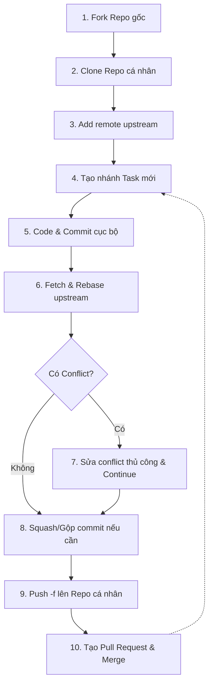

# Tóm tắt Kiến thức & Chức năng Git 

## 1. Git Introduction 

### Tại sao chọn Git?
- **Save different versions of project source code:** Lưu trữ toàn bộ lịch sử và các phiên bản khác nhau của mã nguồn dự án qua từng thời kỳ.
- **Restore source code from any version:** Dễ dàng khôi phục mã nguồn về bất kỳ thời điểm nào trong lịch sử khi cần thiết.
- **Easily compare between versions:** So sánh trực quan sự khác biệt về nội dung giữa các phiên bản hoặc các commit khác nhau.
- **Detect who has fixed which part and caused the error:** Truy xuất chính xác ai đã chỉnh sửa dòng code nào, vào lúc nào để tìm ra nguyên nhân gây lỗi.
- **Recover lost files:** Đề phòng rủi ro mất mát dữ liệu nhờ khả năng khôi phục các tệp tin đã bị xóa ngoài thư mục làm việc.
- **Easy to test, extend project features without affecting main version:** Phát triển độc lập các tính năng mới trên các nhánh phụ mà không ảnh hưởng tới sự ổn định của phiên bản chính trên nhánh `main`/`master`.
- **Help restore and execute projects in teams efficiently:** Tối ưu hóa hiệu suất làm việc nhóm, giúp đồng bộ mã nguồn giữa các thành viên một cách trơn tru.

### 1.1. GIT - Hệ thống quản lý phiên bản phân tán (DVCSs)
- **Cơ chế hoạt động:** 
  - Trái ngược với hệ thống quản lý phiên bản tập trung (CVCS) chỉ lưu dữ liệu trên một máy chủ duy nhất, hệ thống **DVCS (như Git)** cho phép mỗi lập trình viên sở hữu một bản sao lưu toàn vẹn của kho chứa (bao gồm cả cơ sở dữ liệu lịch sử - Version Database) ngay tại máy local.
  - Lập trình viên có thể làm việc, sửa đổi và `commit` (ghi nhận thay đổi) cục bộ mà không cần kết nối internet.
  - Sau đó, mọi người sẽ đồng bộ hóa công việc với kho chứa trung tâm (`Central Repository`) thông qua cơ chế `push` (đẩy code lên) và `pull` (kéo code về).

### 1.2. Git & GitHub
- **Git:** Là công cụ quản lý phiên bản mã nguồn hoạt động cục bộ (dưới dạng dòng lệnh) trên máy tính của cá nhân.
- **GitHub:** Là một dịch vụ lưu trữ kho chứa Git trên đám mây (Cloud). GitHub cung cấp giao diện trực quan và các công cụ quản lý giúp các lập trình viên dễ dàng chia sẻ mã nguồn, phân quyền, review code và cộng tác làm việc nhóm với nhau.

### 1.3. Cài đặt Git
- **Tải Git:** Tải bộ cài tương thích với hệ điều hành đang sử dụng tại [git-scm.com/download](https://git-scm.com/download).
- **Cài đặt nhanh trên hệ điều hành Ubuntu/Debian:**
  ```bash
  sudo apt-get update
  sudo apt-get install git
  ```
- **Cấu hình thông tin tài khoản ban đầu (Git config):** Đây là bước bắt buộc để Git định danh tác giả của mỗi commit.
  ```bash
  git config --global user.name "Your Name"
  git config --global user.email "you@example.com"
  ```

### 1.4. Tra cứu tài liệu hướng dẫn
- Bạn có thể nhanh chóng tra cứu cách sử dụng của bất kỳ lệnh Git nào bằng cú pháp trợ giúp:
  ```bash
  git help <tên_lệnh>
  ```
- *Ví dụ:* Tra cứu chi tiết cách cấu hình lệnh `config`:
  ```bash
  git help config
  ```

---

## 2. Git Basic 

### Kiến trúc 3 vùng làm việc (Three-Tree Architecture)
1. **Working Directory (Thư mục làm việc):** Nơi hiển thị trực tiếp các tệp tin vật lý bạn đang thao tác trên ổ đĩa.
2. **Staging Area (Vùng chuẩn bị):** Nơi chọn lọc và đánh dấu những thay đổi sẵn sàng được đưa vào commit tiếp theo.
3. **Local Repository (Kho chứa cục bộ):** Nơi lưu trữ chính thức toàn bộ lịch sử các commit trong thư mục ẩn `.git`.
4. **Remote Repository (Kho chứa từ xa):** Kho lưu trữ trực tuyến giúp đồng bộ hóa mã nguồn giữa các thành viên.

### Các câu lệnh cơ bản thường dùng
- `git init`: Khởi tạo một Git Repository mới ngay tại thư mục hiện hành.
- `git clone <url>`: Sao chép một dự án có sẵn từ máy chủ từ xa về máy cá nhân.
- `git status`: Kiểm tra trạng thái hiện tại của các tệp tin (chưa được theo dõi, đã sửa đổi, hay đã đưa vào vùng chuẩn bị).
- `git add <tên_file>` (hoặc `git add .` để thêm tất cả): Chuyển các thay đổi từ thư mục làm việc vào vùng chuẩn bị (Staging Area).
- `git commit -m "Thông điệp mô tả"`: Đóng gói và lưu vĩnh viễn các thay đổi từ Staging Area vào kho chứa cục bộ kèm theo ghi chú chi tiết.
- `git log`: Hiển thị danh sách lịch sử các commit đã thực hiện theo trình tự thời gian ngược.

---

## 3. Branching 

Phân nhánh là tính năng cốt lõi giúp bạn tự do thử nghiệm, phát triển các tính năng độc lập mà không lo sợ làm hỏng mã nguồn đang hoạt động ổn định trên nhánh chính (`main`/`master`).

- `git branch`: Liệt kê tất cả các nhánh hiện có ở máy cục bộ. Nhánh đang kích hoạt sẽ được đánh dấu bằng ký tự `*`.
- `git branch <tên_nhánh>`: Khởi tạo một nhánh mới từ vị trí commit hiện tại.
- `git checkout <tên_nhánh>` (hoặc `git switch <tên_nhánh>`): Chuyển đổi không gian làm việc sang nhánh được chỉ định.
- `git checkout -b <tên_nhánh>` (hoặc `git switch -c <tên_nhánh>`): Phím tắt giúp tạo nhánh mới và lập tức chuyển sang nhánh đó.
- `git branch -d <tên_nhánh>`: Xóa một nhánh ở local sau khi đã gộp (merge) thay đổi của nó vào nhánh chính.
- `git branch -D <tên_nhánh>`: Ép buộc xóa nhánh kể cả khi chưa gộp code (thường dùng để loại bỏ các nhánh thử nghiệm thất bại).

---

## 4. Git Merge & Git Rebase 

Khi muốn gộp các thay đổi từ nhánh phụ (ví dụ: phát triển tính năng) vào nhánh chính, bạn có thể lựa chọn một trong hai phương pháp sau:

### Git Merge
- **Cơ chế:** Hợp nhất lịch sử của hai nhánh. Git sẽ tự động tìm kiếm commit chung gần nhất và tạo ra một **Merge Commit** mới đại diện cho điểm hợp nhất đó.
- **Ưu điểm:** Bảo tồn nguyên vẹn lịch sử phát triển thực tế theo thứ tự thời gian của cả hai nhánh.
- **Nhược điểm:** Làm biểu đồ nhánh lịch sử trở nên phức tạp và chằng chịt nếu dự án có nhiều nhánh nhỏ.
- **Cách dùng:**
  ```bash
  git checkout main
  git merge feature-branch
  ```

### Git Rebase
- **Cơ chế:** Thiết lập lại gốc của nhánh hiện tại. Git sẽ tạm thời cất đi các commit trên nhánh phụ của bạn, cập nhật nhánh phụ lên vị trí mới nhất của nhánh chính, sau đó áp dụng tuần tự các commit đã cất trở lại.
- **Ưu điểm:** Tạo ra một lịch sử commit dạng đường thẳng (tuyến tính) cực kỳ sạch sẽ và dễ theo dõi.
- **Nhược điểm:** Viết lại lịch sử commit của dự án. **Nguyên tắc cốt lõi:** Tuyệt đối không sử dụng rebase trên các nhánh dùng chung (nhánh public) đã được đẩy lên Remote Repository.
- **Cách dùng:**
  ```bash
  git checkout feature-branch
  git rebase main
  ```

---

## 5. Git Pull & Git Fetch 

Đồng bộ hóa mã nguồn giữa máy local của bạn và máy chủ từ xa (Remote) khi làm việc trong dự án chung.

- **Git Fetch:**
  - Tải về toàn bộ thông tin thay đổi mới nhất từ remote (commit mới, nhánh mới) nhưng **không** can thiệp hay tự động gộp vào mã nguồn bạn đang viết ở local.
  - Phù hợp khi bạn muốn kiểm tra trạng thái công việc của đồng nghiệp trước khi đưa ra quyết định tích hợp.
  ```bash
  git fetch origin
  ```

- **Git Pull:**
  - Tải về và tự động gộp ngay lập tức các thay đổi từ remote vào nhánh hiện tại ở local.
  - Thực chất: `git pull` = `git fetch` + `git merge`.
  - Có thể xảy ra xung đột (conflict) nếu code local và code remote sửa đổi trên cùng một vùng dữ liệu.
  ```bash
  git pull origin main
  ```

---
## 6. Git Flow

Quy trình làm việc chuẩn giúp đồng bộ và quản lý mã nguồn hiệu quả giữa máy tính cá nhân (Local) và hạ tầng lưu trữ đám mây (GitHub) thông qua việc phân chia môi trường rõ ràng và tuần tự các bước luân chuyển code:

### 6.1. Các môi trường và vùng làm việc
- **Local Machine (Máy cá nhân):**
  - **Working Directory:** Thư mục vật lý chứa các tệp tin mã nguồn đang được chỉnh sửa trực tiếp.
  - **Staging Area:** Vùng đệm chuẩn bị, chọn lọc các thay đổi sẵn sàng để lưu trữ.
  - **Local Repo:** Kho lưu trữ cục bộ chứa toàn bộ lịch sử commit trên máy tính.
- **Remote (GitHub Cloud):**
  - **Your GitHub Repo** (Remote `origin`): Kho chứa cá nhân trên GitHub, được sao chép (Fork) từ kho chính.
  - **Sun* GitHub Repo** (Remote `upstream`): Kho chứa gốc của dự án, do Sun* hoặc khách hàng quản lý và là nơi tích hợp mã nguồn chung.

---

### 6.2. Chu trình 10 bước chuẩn hóa (Workflow Steps)



#### Giai đoạn A: Thiết lập dự án (Chỉ thực hiện 1 lần)
1. **Fork:** Truy cập trang GitHub của dự án chính (`Sun* GitHub repo`), chọn **Fork** để tạo bản sao về tài khoản GitHub cá nhân của bạn.
2. **Clone:** Tải mã nguồn từ repository cá nhân vừa Fork về máy cục bộ để bắt đầu làm việc.
   ```bash
   git clone <url_your_github_repo>
   ```
3. **Add Remote:** Tạo liên kết trực tiếp từ máy cục bộ tới repository chính của Sun* (đặt tên kết nối này là `upstream`).
   ```bash
   git remote add upstream <url_sun_github_repo>
   ```

#### Giai đoạn B: Chu trình phát triển tính năng (Lặp lại cho mỗi Task)
4. **Branch working:** Tạo một nhánh nhiệm vụ mới tách từ nhánh phát triển chung (`develop`/`main`) để làm việc độc lập.
   ```bash
   git checkout -b <tên_nhánh_task>
   ```
5. **Add & Commit:** Đưa các thay đổi từ Working Directory vào Staging Area và lưu chính thức vào Local Repo.
   ```bash
   git add .
   git commit -m "Mô tả ngắn gọn tính năng đã hoàn thành"
   ```
6. **Rebase code:** Tải mã nguồn mới nhất từ repository chính (`upstream`) về và đắp các commit của bạn lên trên cùng nhánh gốc để tránh bị lệch code.
   ```bash
   git fetch upstream
   git rebase upstream/develop
   ```
7. **Fix conflict:** Nếu xảy ra xung đột khi rebase, hãy mở file để xử lý thủ công, sau đó tiếp tục quá trình rebase.
   ```bash
   # Chỉnh sửa file bị xung đột, sau đó chạy:
   git add <tên_file_xung_đột>
   git rebase --continue
   ```
8. **Rebase commit (Squash):** Gộp các commit nhỏ/nháp thành một hoặc vài commit lớn có ý nghĩa rõ ràng trước khi gửi review.
   ```bash
   git rebase -i HEAD~<số_lượng_commit>
   ```
9. **Create Pull Request (PR):** Đẩy nhánh lên repository cá nhân và tạo **Pull Request** trên giao diện web GitHub để gửi code sang dự án gốc.
   ```bash
   git push origin <tên_nhánh_task> -f
   ```
10. **Merged:** Người quản lý tiến hành review và gộp code của bạn vào dự án chính. Nhiệm vụ hoàn thành, quay lại **Bước 4** cho Task tiếp theo.

---

## 7. Case Studies

### 1. Combine commits into one (Gộp nhiều commit thành một commit duy nhất)
```bash
$ git rebase -i HEAD~<number of commit>
# Eg: git rebase -i HEAD~3

# (Before editing) commits are displayed in order
pick aa11bbc commit message 1
pick b2c3c4d commit message 2
pick 4e56fgh commit message 3
```
* **Giải thích chi tiết:**
  - `git rebase -i HEAD~3`: Mở giao diện rebase tương tác (`-i` là viết tắt của interactive) cho 3 commit gần nhất tính từ vị trí con trỏ `HEAD`.
  - Trình soạn thảo sẽ hiển thị danh sách commit theo thứ tự từ cũ nhất đến mới nhất.
  - **Thao tác gộp:** Đổi chữ `pick` thành `squash` (hoặc viết tắt là `s`) trước các commit bạn muốn gộp vào commit nằm ngay phía trên nó. Sau khi lưu lại, Git sẽ yêu cầu bạn xác nhận hoặc chỉnh sửa lại thông điệp commit chung cuối cùng.

---

### 2. Ignore committed file (Bỏ qua tệp tin đã lỡ commit và push lên repository)
```bash
# First, remove committed file from repository
$ git rm --cached <filename>

# Then, add to gitignore
$ echo '<filename>' >> .gitignore
```
* **Giải thích chi tiết:**
  - `git rm --cached <filename>`: Loại bỏ tệp tin khỏi chỉ mục theo dõi của Git (index/repository) nhưng vẫn bảo toàn tệp vật lý trong thư mục làm việc cục bộ của bạn.
  - `echo '<filename>' >> .gitignore`: Thêm tên tệp tin vào tệp cấu hình `.gitignore` để Git tự động bỏ qua và không theo dõi những thay đổi của tệp này ở các lần commit tiếp theo.

---

### 3. Rename branch (Đổi tên nhánh)
```bash
$ git branch -m <new name of branch>
```
* **Giải thích chi tiết:**
  - Đổi tên nhánh hiện tại bạn đang làm việc (nhánh đang checkout) sang một tên mới phù hợp hơn với quy chuẩn dự án.
  - Cờ `-m` là viết tắt của từ "move/rename".

---

### 4. Commit to other branch by mistake (Commit nhầm sang nhánh khác)
```bash
# Frist, create new branch to store all current commits
$ git branch other-branch

# Then, move HEAD, index of current branch to 1 commit ahead
$ git reset --hard HEAD~

# Checkout to branch which has that commit
$ git checkout other-branch
```
* **Giải thích chi tiết:**
  - `git branch other-branch`: Tạo nhanh một nhánh mới tên là `other-branch` ngay tại commit hiện tại để bảo toàn toàn bộ code vừa thay đổi.
  - `git reset --hard HEAD~`: Quay ngược nhánh bị nhầm về trước đó 1 commit (`HEAD~`) và loại bỏ thay đổi nhầm khỏi nhánh này. Lúc này commit đã được tách và lưu giữ an toàn bên `other-branch`.
  - `git checkout other-branch`: Chuyển sang nhánh mới tạo chứa commit chuẩn để tiếp tục phát triển.

---

### 5. Commit by mistake and remove it (Commit nhầm và các phương pháp hoàn tác)
```bash
# 1. Move HEAD to previous commit (keeps modifications in staging area)
$ git reset --soft HEAD~

# 2. Move HEAD and index to previous commit (keeps modifications in working tree)
$ git reset HEAD~

# 3. Move index and working tree to previous commit (discard changes entirely)
$ git reset --hard HEAD~

# 4. Record new commit to reverse the effect of earlier commits (safe for shared branches)
$ git revert <commit>
```
* **Giải thích chi tiết:**
  - `git reset --soft HEAD~`: Hoàn tác commit gần nhất. Con trỏ `HEAD` lùi về 1 commit, giữ nguyên toàn bộ thay đổi ở vùng **Staging Area** (sẵn sàng để commit lại).
  - `git reset HEAD~` (hoặc cờ `--mixed` mặc định): Hoàn tác commit và đưa các thay đổi về vùng **Working Directory** (chưa được Staged, cần `git add` lại nếu muốn lưu).
  - `git reset --hard HEAD~`: Xóa bỏ hoàn toàn commit gần nhất cùng toàn bộ mã nguồn vừa chỉnh sửa, đưa làm việc về trạng thái chính xác của commit trước đó (cần cẩn trọng khi dùng).
  - `git revert <commit>`: Tạo một commit mới mang nội dung đảo ngược để triệt tiêu ảnh hưởng của commit cũ. Phương pháp này giữ nguyên lịch sử commit, an toàn tuyệt đối khi làm việc nhóm trên các nhánh chung.

---

### 6. Combine commits from other branch (Gộp một commit cụ thể từ nhánh khác)
```bash
$ git cherry-pick <commit-id>
```
* **Giải thích chi tiết:**
  - `git cherry-pick <commit-id>`: Trích xuất một commit cụ thể (thông qua mã hash/ID commit) từ một nhánh khác và áp dụng trực tiếp vào nhánh hiện tại mà không cần phải hợp nhất (merge) toàn bộ nhánh.

---

### 7. In the middle of work but navigate to other branch (Tạm lưu công việc dở dang để chuyển nhánh)
```bash
# Save unfinished work
$ git stash -u

# check out to new branch
$ git checkout -b other-branch
~ work, work, work ~
$ git add <necessary files>
$ git commit -m "commit message"

# checkout to origin branch
$ git checkout origin-branch

# Restore the unfinished work
$ git stash pop
```
* **Giải thích chi tiết:**
  - `git stash -u`: Tạm thời cất giấu toàn bộ thay đổi chưa commit (bao gồm cả tệp chưa được theo dõi nhờ cờ `-u`/`--include-untracked`) vào ngăn xếp tạm của Git, giúp thư mục làm việc trở nên sạch sẽ.
  - `git checkout -b other-branch`: Chuyển sang nhánh khác thực hiện nhiệm vụ khẩn cấp và commit bình thường.
  - `git checkout origin-branch`: Quay lại nhánh ban đầu sau khi xử lý xong nhiệm vụ khẩn cấp.
  - `git stash pop`: Lấy lại toàn bộ mã nguồn đang làm dở lúc trước ra khỏi ngăn xếp để tiếp tục công việc.

---

### 8. Remove important commit by mistake (Khôi phục commit quan trọng bị xóa nhầm)
```bash
# First, see all the commits' history
$ git reflog

# Then, pick the commit to restore
$ git reset --hard <commit>
```
* **Giải thích chi tiết:**
  - `git reflog`: Tra cứu nhật ký hành động lịch sử của con trỏ HEAD. Ngay cả khi commit đã bị reset hoặc xóa mất, `reflog` vẫn ghi lại mã hash của commit đó.
  - `git reset --hard <commit>`: Khôi phục toàn bộ trạng thái mã nguồn về đúng mã commit đã tìm thấy trong reflog.

---

### 9. Merged but want to undo (Hoàn tác thao tác gộp nhánh vừa thực hiện)
```bash
# merge
$ git checkout <original branch>
$ git merge <merged branch>

# Then, want to turn back
$ git reset --hard ORIG_HEAD
```
* **Giải thích chi tiết:**
  - Ngay sau khi thực hiện `git merge`, Git sẽ tự động lưu lại vị trí trước khi merge của nhánh hiện tại vào biến môi trường con trỏ `ORIG_HEAD`.
  - `git reset --hard ORIG_HEAD`: Đưa nhánh hiện tại quay trở lại vị trí chính xác trước thời điểm gộp nhánh, hủy bỏ toàn bộ thao tác merge vừa rồi.
